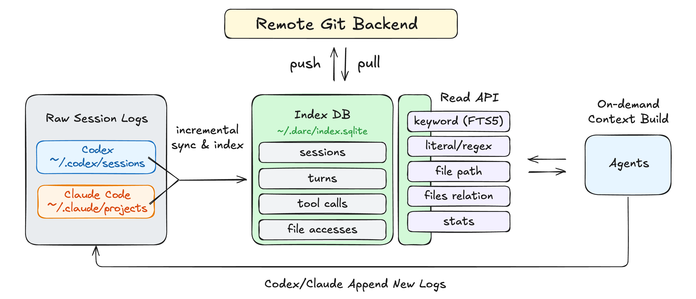

# Darc

[](LICENSE)
[](https://github.com/0xjunha/darc/actions/workflows/ci.yml)
[](https://codecov.io/github/0xjunha/darc)

> Darc indexes your agent sessions so you can grep them like code, then open exact evidence from prior work.

A local CLI for searching Claude Code and Codex session history.

Use it to recover the rationale, cautions, touched files, and rejected approaches behind previous agent work before
making the next change.

Darc gives agents the equivalent of asking the engineer who last touched the code what they learned and what to watch
out for.

Supports: **macOS/Linux** | **Claude Code/Codex**

_Demo: search prior agent history, open the exact turn, and list files touched in that session._

https://github.com/user-attachments/assets/f38317a4-bcc8-438a-8a81-0315b5c8a4e9

## Quickstart

```sh
# 1. Install (macOS/Linux)
curl -fsSL https://github.com/0xjunha/darc/releases/latest/download/darc-installer.sh | sh

# 2. Go to a project where you use Claude Code or Codex
cd /path/to/project

# 3. Register the project in your local Darc workspace
darc init

# 4. Sync and index existing agent sessions once
darc refresh

# 5. Teach your agents when to use Darc
#    Adds guidance to recover prior-session evidence when relevant and verify it against current files/tests.
darc agent-help --agents-md-line >> AGENTS.md
# or:
darc agent-help --agents-md-line >> CLAUDE.md

# 6. Test Darc manually
darc search "something you worked on before" --limit 5
```

Optional: keep the index fresh automatically on macOS.

```sh
darc refresh --auto
```

After that, future agents can use Darc to recover prior evidence before making changes.

A typical agent workflow:

1. Check the active project with `darc status` or `darc status --json`.
2. Discover candidates with small `darc search`, `darc list`, or `darc stats` reads.
3. Skim a candidate session with `darc list turns <SESSION_ID> --view oneline`.
4. Open the exact evidence with `darc show turn <SESSION_ID> <TURN_ORDINAL>`.
5. Pivot through related files with `darc list files --co-touched-with <path>` or
   `darc list sessions --touching <glob>`.

## Example: Search and Drill Down

Search prior agent work:

```sh
darc search "auth refresh bug" --since 30d --limit 3
```

Example output, trimmed:

```json
{
  "schema": "darc.query.search.turns.v1",
  "data": {
    "hits": [
      {
        "provider": "codex",
        "session_id": "11111111-1111-4111-8111-111111111111",
        "turn_ordinal": 18,
        "snippet": "Investigated token refresh failure in src/auth/session.rs",
        "matched_paths": [
          "src/auth/session.rs",
          "tests/auth_refresh.rs"
        ]
      }
    ],
    "has_more": false
  }
}
```

Then drill into the exact evidence:

```sh
darc show turn 11111111 18 --step-limit 10
```

Or skim the surrounding session first:

```sh
darc list turns 11111111 --view oneline --limit 20
```

## Why Darc?

Coding agents often uncover useful context once, then lose it across sessions.

Darc lets you ask:

- "Did we already debug this `database is locked` failure?"
- "Why did we keep this compatibility fallback instead of deleting it?"
- "What alternatives did we reject before landing this implementation?"
- "Which exact turn explains this workaround in `src/auth/session.rs`?"
- "Which files usually changed together with `src/auth/session.rs`?"

Instead of dumping raw transcript logs into a prompt, Darc gives agents small, structured, evidence-backed reads they
can chain safely.

## Useful Prompts With Darc

The `AGENTS.md` / `CLAUDE.md` guidance teaches agents to use Darc when prior context may matter. You can also invoke
Darc explicitly in a prompt when you want an agent to investigate prior sessions.

Darc provides exact prior-session evidence; the agent synthesizes it and verifies current facts against the repository.

Example prompts:

```text
Use Darc CLI to review the last 30 days of agent sessions. Group the work
into distinct workstreams, summarize what looks resolved or open, and cite
the key session/turn evidence.
```

```text
Use Darc CLI to find important implementation decisions that are not
obvious from current code or docs. Explain the rationale and cite evidence.
```

```text
Use Darc CLI to investigate repeated failures around <module-or-feature>.
Identify recurring patterns, fixes already tried, and risks that still
need verification.
```

For broad investigations, add this line to the end of the prompt:

```text
In your answer, separate Darc evidence, current source/test verification, and remaining uncertainty.
```

## Common Workflows

### Search Prior Debugging

```sh
darc search "panic unwrap" --since 30d --limit 5
darc list turns <SESSION_ID> --view oneline --limit 20
darc show turn <SESSION_ID> <TURN_ORDINAL> --step-limit 10
```

### Find Sessions That Touched a File

```sh
darc list sessions --touching "src/auth/session.rs" --limit 10
darc list turns <SESSION_ID> --view oneline --limit 20
```

### Find Related Files

```sh
darc list files --co-touched-with src/auth/session.rs --limit 10
```

### Search Exact Text

```sh
darc search \
  --mode literal \
  --query "database is locked" \
  --include-tool-output \
  --limit 5
```

### Search Tool Output

```sh
darc search \
  --mode regex \
  --query "error\s+code" \
  --include-tool-output \
  --since 7d \
  --limit 5
```

### Resolve a Quoted Session

```sh
darc resolve session <SESSION_PREFIX> --pick-one
darc show session <SESSION_ID> --turn-limit 5 --step-limit 10
```

## Why Not Just `rg` the Raw Logs?

You can. For simple text search, raw `rg` is often enough.

Darc becomes useful when you need structured recovery, not just matching lines.

| Raw `rg` over logs | Darc |
| --- | --- |
| Follow-up context is ad hoc | Provides stable schema ids and evidence handles |
| You infer the surrounding context | Links the hit to the original turn, session, files, and metrics |
| Finds matching log text | Returns `session_id` and `turn_ordinal` |
| File pivots are manual | Queries sessions, files, co-touched paths, and related work |
| Project identity is implicit | Preserves registered project identity across checkout moves, worktrees, and renames |
| Returns raw log lines | Returns bounded, agent-safe JSON |

Darc is not trying to replace `rg`. It gives `rg`-like discovery over agent history plus the structured handles needed
to recover exact prior work and build context.

## Darc Is Not Another Memory System

Darc does **not** summarize your work, decide what is important, or rewrite agent state.

Agent memory is useful, but it is selective by design. Summaries are lossy, and every memory layer has to decide what
is worth keeping.

Darc takes a different path: agents are already good at using tools, so Darc gives them a local search tool over prior
sessions. They can build context on demand from exact evidence instead of relying only on distilled memory.

Use Darc with:

- `AGENTS.md` or `CLAUDE.md` for explicit, versioned project instructions
- Codex and Claude Code memory for preferences, corrections, workflows, and high-level context
- Darc for exact prior-session evidence: sessions, turns, tool-call evidence, files, and citations

The goal is not "remember everything forever." The goal is to let agents ask narrow questions, retrieve bounded
evidence, and avoid repeating old work.

## How Darc Works



Darc keeps one local workspace at `~/.darc`.

A workspace contains many projects, one per registered checkout. Each project has its own archive of synced sessions,
and a workspace-wide SQLite index normalizes those archives for query.

Core concepts:

- A **session** is one run of Claude Code or Codex.
- A **turn** is one user-message-and-agent-response pair within a session.
- A **project** is a registered checkout Darc can resolve from your current directory.
- An **evidence handle** is the combination of `session_id`, `turn_ordinal`, paths, timestamps, and schema-tagged JSON
  output needed to find the same evidence again later.

Most read commands infer the active project from your current working directory.

```sh
cd /path/to/project
darc search "query"
```

## Core Commands

| Need | Command |
| --- | --- |
| Register the current project | `darc init` |
| Sync and index sessions once | `darc refresh` |
| Keep sessions fresh automatically on macOS | `darc refresh --auto` |
| Check project state and freshness | `darc status` |
| Show agent-facing usage guidance | `darc agent-help` |
| Browse recent sessions | `darc list sessions` |
| Search indexed turns | `darc search <query>` |
| Skim turns in one session | `darc list turns <SESSION_ID> --view oneline` |
| Inspect exact turn evidence | `darc show turn <SESSION_ID> <TURN_ORDINAL>` |
| Inspect a bounded session bundle | `darc show session <SESSION_ID>` |
| Rank touched files | `darc list files` |
| Find sessions touching a path | `darc list sessions --touching "src/**/*.rs"` |
| Find files often touched together | `darc list files --co-touched-with src/auth/session.rs` |
| Resolve a partial UUID | `darc resolve session <prefix>` |
| Show project metrics | `darc stats project` |
| Show workspace metrics | `darc stats workspace` |

Run `darc --help` or `darc help <command>` for the current CLI surface.

## Documentation

- [Documentation index](docs/README.md)
- [Query protocol](docs/query-protocol.md): JSON envelopes, command contracts, search modes, payload semantics, and
  error contracts.
- [Background refresh service](docs/service.md): macOS auto-refresh service behavior and watch settings.
- [Project rename and linking](docs/project-rename.md): keep history across checkout moves and repository renames.
- [Upgrade and uninstall](docs/upgrade-uninstall.md)

## Privacy and Local-First Behavior

Darc reads local agent rollouts and writes archive/query state under `~/.darc`.

- No Darc cloud account is required.
- Session archives and query indexes stay local.
- Read commands query your local SQLite index.
- Optional upgrade checks contact GitHub only for release metadata and require explicit opt-in.

## Current Limitations

- Darc currently supports Claude Code and Codex local session histories.
- macOS and Linux are supported.
- `darc refresh --auto` is macOS-only for now.
- Linux users can run `darc refresh` manually or wire it into their own watcher.
- Darc retrieves exact evidence; it does not summarize or rank durable decisions for you.
- File analytics are best-effort, derived from normalized tool calls and observed command text, not syscall-level
  tracing.

## Development

Darc is split into focused Rust crates:

- `crates/cli`: command-line surface.
- `darc-core`: thin facade and orchestration layer.
- `darc-sync`: source discovery, sync planning, and archive copy execution.
- `darc-store`: SQLite schema, migrations, and derived-index analytics shared by indexing and query.
- `darc-index`: normalized archive ingestion and duplicate resolution.
- `darc-query`: read-only query, search, and stats over indexed data.
- `darc-rollout`: provider transcript models and parsers.
- `darc-paths`, `darc-rollout-audit`, and `darc-test-utils`: shared support, maintainer audits, and tests.

Useful checks:

```sh
cargo +nightly fmt
cargo +stable clippy --locked --workspace --all-targets --all-features -- -D warnings -W clippy::all
cargo +stable test --locked --workspace
cargo +stable check --locked --workspace --all-targets --all-features --profile dist
```
